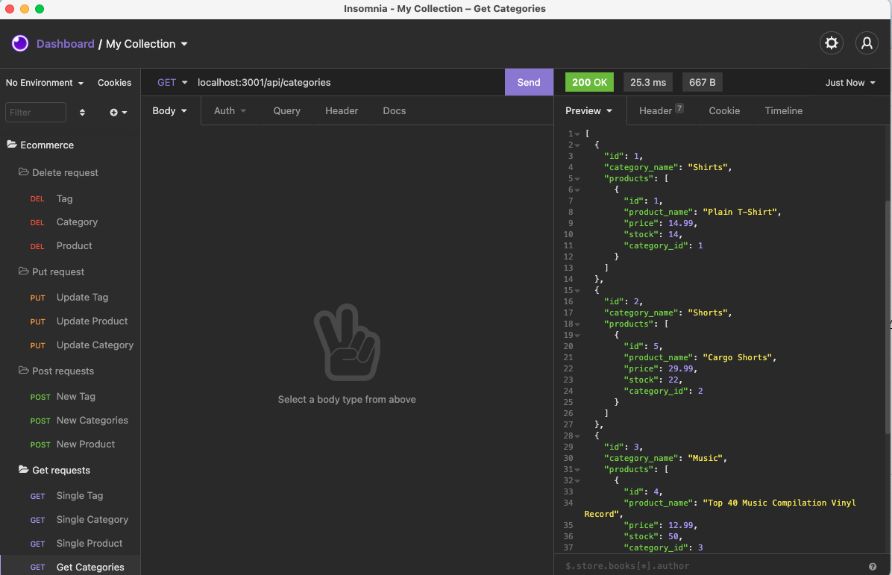

# E-commerce-Website

  ************************

  

  ## Table of Contents
  1.  [Description](#Description)
  2.  [Installation](#Installation)
  3.  [Usage](#Usage)
  4.  [License](#License)
  5.  [Contributing](#Contributing)
  6.  [Questions](#Questions)

  ## Description
  This is app is the back end for an e-commerce site and it was built using modified started code. The app uses Express.js API to use Sequelize to interact with a MySQL database.
  

  ## Installation

  *Please clone the github repository and then run NMP I.*

 

  ## Usage
  Open an integrated terminal and run node server.js. 
  You will then need to populate the data base by entering NPM run seed.
  Next run NPM start. You will now be connected to the server and listening to the local host and able to start testing.

  ## License
 This application has the following license:
 [MIT License](https://opensource.org/licenses/MIT)

  ## Contributing
  Please email me to discuss further.

 

## Questions
*If you would like to know more or have a question you'd like to ask, please contact me via email marc.malliate@gmail.com or you may also like to checkout my work [here](https://github.com/marcmalliate)*

### You may also like to view the GitHub repository which contains the code repository: 
https://github.com/marcmalliate/E-commerce-Website

### Screenshot of application:

GET request for all categories:

POST request for a new category:

PUT request to update an existing category:

DELETE request to delete an existing category:

For a more detailed demonstration please watch the 2 videos below

### Video demonstration of application:
Please note, this video demonstration is split into 2 parts.

https://watch.screencastify.com/v/ad4TkvXm0I62SObeQRCm

https://watch.screencastify.com/v/lpdOeKFeKq2lUM17nAia

© *2021 Marc Malliate - Professional Readme Generator*
